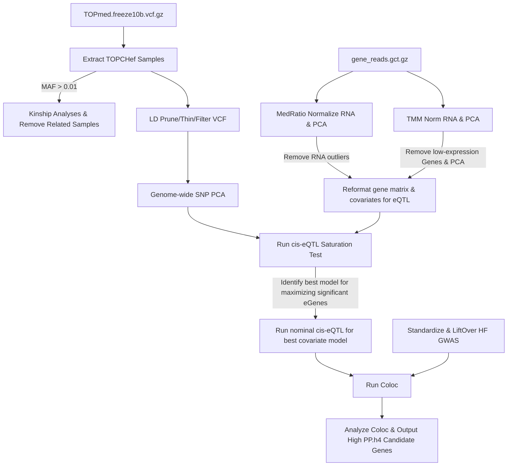

# QC Pipeline of DNA- and RNA-seq for use in cis-eQTL mapping


This repository contains a Nextflow DSL2 pipeline for DNA QC, RNA QC, kinship analysis, and reformatting for use in TensorQTL eQTL mapping. The pipeline performs various steps including extracting and indexing VCF files, calculating linkage disequilibrium, thinning VCF files, and conducting PCA analyses.

## Pipeline Overview



## Installation
To run this pipeline, you need to have *Nextflow* and *Apptainer* installed.
I am building a apptainer container (sandbox) to have some of the following dependencies installed:
```
- NextFlow
- Apptainer
- bcftools/1.17
- plink/2.00a20230303
- King/2.3.2
- R/4.3.1
- Python/3.11.4
- htslib/1.17
```

To build a sandbox for this nf pipeline use this apptainer code, make sure ```Singularity.def``` and ```environment.yml``` is within your working directory: 
```sh
apptainer build --sandbox nf_topchef Singularity.def
```

## Usage
To run the pipeline, use the following command:
```sh
nextflow run main_TensorQTL.nf -profile slurm
```

After finishing the preparation files you can run TensorQTL with the following command:
```sh
nextflow run main_tensorqtl_submission.nf -profile slurm 
```

## Main Scripts
- `main_TensorQTL.nf`: The main Nextflow script that defines the workflow.
- `main_tensorqtl_submission.nf`: Nextflow processes related to running TensorQTL.
- `modules/`: Directory containing modules for each step of the pipeline.
  - `mainRNA_flow.nf`: Module for RNA normalization, PCA, and outlier detection.
  - `concatvcf.nf`: Module for concatenating VCF files.
  - `king.nf`: Module for running kinship analyses.
  - `SNP_PCA.nf`: Module for performing SNP PCA and outlier detection.
  - `reformat_eqtl.nf`: Module for reformatting PC covariates and VCF for cis-eQTL pipeline.
  - `coloc.nf`: Module for running coloc analyses on general GWAS summary statistics.
- `scripts/`: Directory containing auxiliary scripts used in the pipeline.
  - `collapse_annotations.py`: Collects the longest ORF for each gene transcript.
  - `reformat_TSS_gtf.py`: Reformats the GTF to account for transcription start sites.
  - `medratio_norm_pca.py`: Script for RNA median ratio normalization and PCA.
  - `tmm_norm_pca_sex.py`: Script for RNA TMM normalization, PCA, and sex assessment.
  - `plot_king.R`: Plots kinship results and outputs related individuals.
  - `vcf2gds.R`: Formats the VCF into a genomic data structure (GDS).
  - `topchef_dna_pca.R`: Makes the SNP PCA and outputs corresponding genetic ancestry PCs.
  - `reformat_eqtl.R`: Reformats the covariates and phenotype files for TensorQTL.
  - `prep_GWAS_eQTL_for_coloc.R`: Prepares GWAS summary data for coloc analysis.
  - `run_cisNominaleQTL_coloc.R`: Runs coloc analysis.
  - `analysis_coloc.R`: Analyzes coloc results and plot.

## Configuration
The pipeline can be configured using the ```nextflow.config``` file. You can specify any parameters such as input files, output directories, and resource requirements like memory and CPUs.

## Contributing
Contributions are welcome! I am still learning *NextFlow* and would love to learn more. Please open an issue or submit a pull request on GitHub.

## License
This project is licensed under the MIT License.

## Citation
TBD! 
