# QC Pipeline of DNA and RNAseq for use in eQTL mapping


This repository contains a Nextflow DSL2 pipeline for DNA QC, RNA QC, kinship analysis, and reformatting for use in TensorQTL eQTL mapping. The pipeline performs various steps including extracting and indexing VCF files, calculating linkage disequilibrium, thinning VCF files, and conducting PCA analyses.

## Pipeline Overview

```mermaid
graph TD
    subgraph DNA
        style DNA fill:lavender,stroke:#333,stroke-width:2px,font-size:16px
        A[Jobs by Chromosomes] --> B[ExtractAndIndexVCF]
        B --> |MAC > 1 & indels > 50bps| C[ConcatVCF]
        C --> |MAF > 0.01| D[King]
        D --> |kinship.kin| E[PlotKinship]
        B -->  |MAC > 1 & indels > 50bps| F[LDPruning]
        F -->  |--indep-pairwise 100 10 0.1| G[VCFThin]
        G --> |every 250 SNPs| H[ConcatVCF]
        H --> I[VCF_to_GDS]
        I --> J[SNP_PCA]
    end

    subgraph RNA
        style RNA fill:lightblue,stroke:#333,stroke-width:2px,font-size:16px
        AA[gene_reads.gct.gz] --> K[normalize_and_pca]
        K --> |Remove RNA outliers| N[reformat_split_eqtl]
        M[tmm_pipeline] --> |TMM normalize and PCA| N
        AA --> M
    end
```



## Installation
To run this pipeline, you need to have Nextflow installed.
You also need to have the following dependencies installed:
- bcftools/1.17
- plink/2.00a20230303
- King/2.3.2
- R/4.3.1
- Python/3.11.4
- htslib/1.17

## Usage
To run the pipeline, use the following command:
```sh
nextflow run main_TensorQTL.nf -profile slurm
```

After finishing the preperation files you can run TensorQTL with the following command:
```sh
nextflow run main_tensorqtl_submission.nf -profile slurm 
```

## Main Scripts
- `main_TensorQTL.nf`: The main Nextflow script that defines the workflow.
- `main_tensorqtl_submission.nf`: Nextflow processes related to running TensorQTL.
- `modules/`: Directory containing modules for each step of the pipeline.
  - `mainRNA_flow.nf`: Module for RNA normalization, PCA, and outlier detection.
  - `concatvcf.nf`: Module for concatenating VCF files.
  - `king.nf`: Module for running kinship analyses.
  - `SNP_PCA.nf`: Module for performing SNP PCA and outlier detection.
  - `reformat_eqtl.nf`: Module for reformatting PC covariates and VCF for cis-eQTL pipeline.
- `scripts/`: Directory containing auxiliary scripts used in the pipeline.
  - `collapse_annotations.py`: Collects the longest ORF for each gene transcript.
  - `reformat_TSS_gtf.py`: Reformats the GTF to accound for transcription start sites.
  - `medratio_norm_pca.py`: Script for RNA median ratio normalization and PCA.
  - `tmm_norm_pca_sex.py`: Script for RNA TMM normalization, PCA, and sex assessment.
  - `plot_king.R`: Plots kinship results and outputs related individuals.
  - `vcf2gds.R`: Formats the VCF into a genomic data structure (GDS).
  - `topchef_dna_pca.R`: Makes the SNP PCA and outputs corresponding genetic ancestry PCs.  
  - `reformat_eqtl.R`: Reformats the covariates and phenotype files for TensorQTL.

## Configuration
The pipeline can be configured using a `nextflow.config` file. You can specify any parameters such as input files, output directories, and resource requirements like memory and CPUs.

## Contributing
Contributions are welcome! I am still learning NextFlow and would love to learn more. Please open an issue or submit a pull request on GitHub.

## License
This project is licensed under the MIT License.
