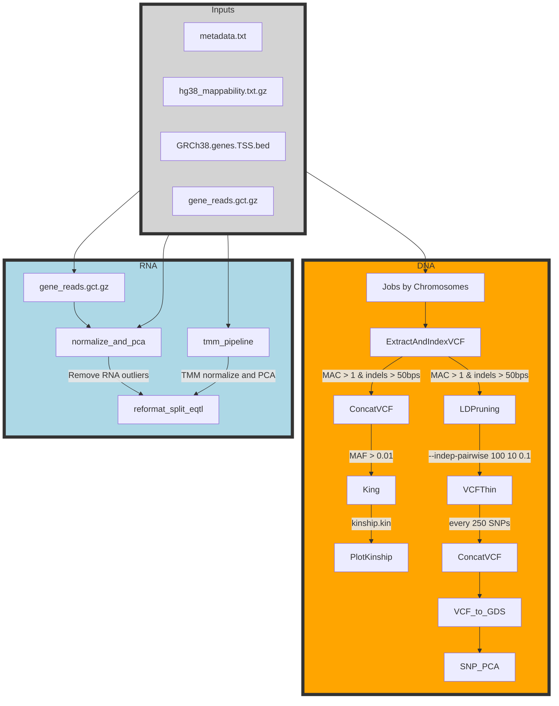

# DNA Filtration and Kinship Pipeline

This repository contains a Nextflow DSL2 pipeline for DNA filtration and kinship analysis. The pipeline performs various steps including reading a list of chromosomes, extracting and indexing VCF files, calculating linkage disequilibrium, thinning VCF files, and creating GDS objects for SNP PCA analysis.

## Pipeline Overview



## Installation
To run this pipeline, you need to have Nextflow installed. You can install Nextflow using the following command:
You also need to have the following dependencies installed:
- bcftools/1.17
- plink/2.00a20230303
- King/2.3.2
- R/4.3.1
- Python/3.11.4
- htslib/1.17

## Usage
To run the pipeline, use the following command:
```sh
nextflow run main_TensorQTL.nf -profile slurm
```

## Main Scripts
- `main_TensorQTL.nf`: The main Nextflow script that defines the workflow.
- `modules/`: Directory containing Nextflow modules for each step of the pipeline.
  - `mainRNA_flow.nf`: Module for RNA normalization and PCA.
  - `reformat_group_cov.nf`: Module for reformatting group covariates.
  - `concatvcf.nf`: Module for concatenating VCF files.
  - `king.nf`: Module for running King and plotting kinship.
  - `SNP_PCA.nf`: Module for creating GDS objects and performing SNP PCA.
  - `reformat_split_eqtl.nf`: Module for reformatting PC covariates and VCF for cis-eQTL pipeline.
- `scripts/`: Directory containing auxiliary scripts used in the pipeline.
  - `medratio_norm_pca.py`: Script for median ratio normalization and PCA.
  - `tmm_norm_pca_sex.py`: Script for TMM normalization, PCA, and sex assessment.

## Configuration
The pipeline can be configured using a `nextflow.config` file. You can specify any parameters such as input files, output directories, and resource requirements like memory and CPUs.

## Contributing
Contributions are welcome! I am still learning NextFlow and would love to learn more. Please open an issue or submit a pull request on GitHub.

## License
This project is licensed under the MIT License.
