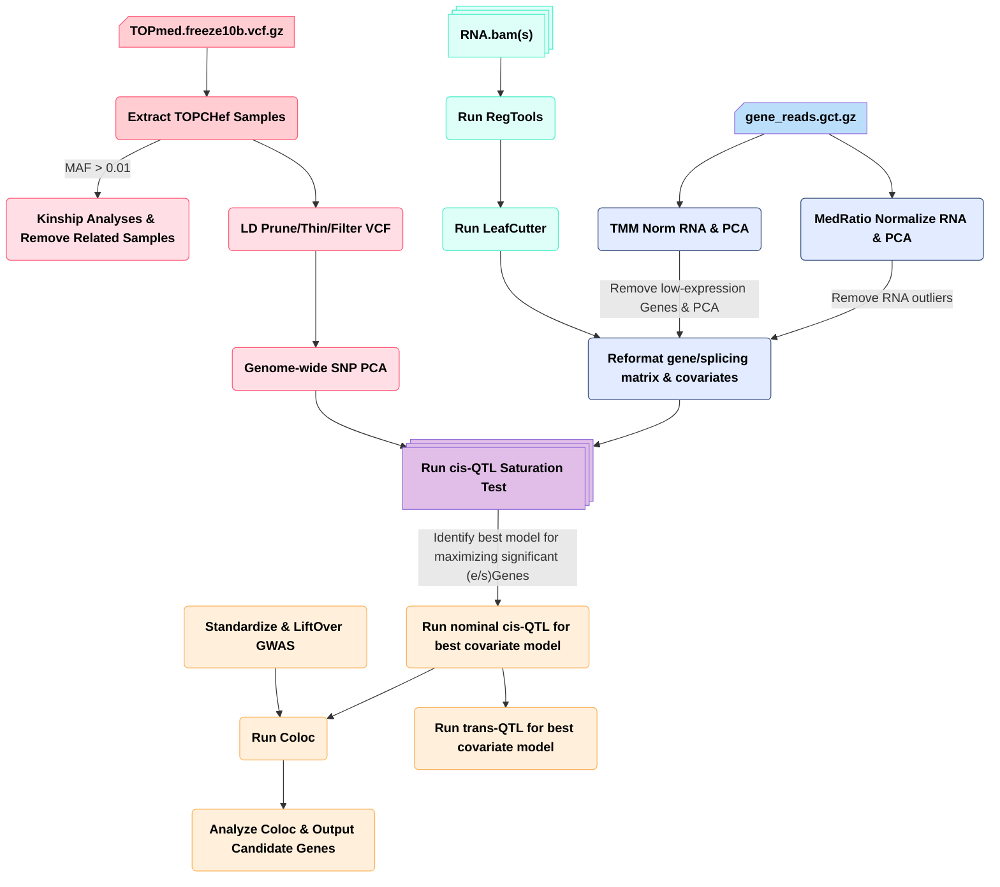

# 🧬 Pipeline of DNA- and RNA-seq for eQTL/sQTL Mapping and Loci Prioritization


## Overview

This repository contains a **Nextflow DSL2 pipeline** for performing DNA QC, RNA QC, kinship analysis, and data reformatting for use in **TensorQTL** QTL mapping.  

The pipeline includes:
- Extracting, indexing, and filtering VCF files  
- PCA analyses for both genotypes and RNA expression  
- eQTL and sQTL analyses  
- Colocalization (coloc) analyses  
- Plotting and downstream interpretation  

## Pipeline Overview


```mermaid
---
config:
  layout: dagre
---
flowchart TD
    A["<b>TOPmed.freeze10b.vcf.gz</b>"] --> B["<b>Extract TOPCHef Samples</b>"]
    B -- "MAF > 0.01" --> D["<b>Kinship Analyses &amp; Remove Related Samples</b>"]
    B --> G["<b>LD Prune/Thin/Filter VCF</b>"]
    G --> J["<b>Genome-wide SNP PCA</b>"]
    AA["<b>gene_reads.gct.gz</b>"] --> K["<b>MedRatio Normalize RNA &amp; PCA</b>"] & M["<b>TMM Norm RNA &amp; PCA</b>"]
    K -- Remove RNA outliers --> N["<b>Reformat gene/splicing matrix &amp; covariates</b>"]
    M -- "Remove low-expression Genes & PCA" --> N
    N --> nn["<b>Run cis-QTL Saturation Test</b>"]
    J --> nn
    nn -- Identify best model for maximizing significant (e/s)Genes --> jj["<b>Run nominal cis-QTL for best covariate model</b>"]
    jj --> P["<b>Run Coloc</b>"] & n1["<b>Run trans-QTL for best covariate model</b>"]
    O["<b>Standardize &amp; LiftOver GWAS</b>"] --> P
    P --> Q["<b>Analyze Coloc &amp; Output Candidate Genes</b>"]
    QQQ["<b>Run RegTools</b>"] --> n2["<b>Run LeafCutter</b>"]
    QQ["<b>RNA.bam(s)</b>"] --> QQQ
    n2 --> N
    A@{ shape: card}
    B@{ shape: rounded}
    D@{ shape: rounded}
    G@{ shape: rounded}
    J@{ shape: rounded}
    AA@{ shape: card}
    K@{ shape: rounded}
    M@{ shape: rounded}
    N@{ shape: rounded}
    nn@{ shape: procs}
    jj@{ shape: rounded}
    P@{ shape: rounded}
    n1@{ shape: rounded}
    O@{ shape: rounded}
    Q@{ shape: rounded}
    QQQ@{ shape: rounded}
    n2@{ shape: rounded}
    QQ@{ shape: procs}
     A:::Rose
     B:::Rose
     D:::Rose
     G:::Rose
     J:::Rose
     K:::Sky
     M:::Sky
     N:::Sky
     jj:::Peach
     P:::Peach
     n1:::Peach
     O:::Peach
     Q:::Peach
     QQQ:::Aqua
     n2:::Aqua
     QQ:::Aqua
    classDef Aqua stroke-width:1px, stroke-dasharray:none, stroke:#46EDC8, fill:#DEFFF8, color:#378E7A
    classDef Sky stroke-width:1px, stroke-dasharray:none, stroke:#374D7C, fill:#E2EBFF, color:#374D7C
    classDef Rose stroke-width:1px, stroke-dasharray:none, stroke:#FF5978, fill:#FFDFE5, color:#8E2236
    classDef Pine stroke-width:1px, stroke-dasharray:none, stroke:#254336, fill:#27654A, color:#FFFFFF
    classDef Peach stroke-width:1px, stroke-dasharray:none, stroke:#FBB35A, fill:#FFEFDB, color:#8F632D
    style A color:#000000,fill:#FFCDD2
    style B fill:#FFCDD2,color:#000000
    style D color:#000000
    style G color:#000000
    style J color:#000000
    style AA fill:#BBDEFB,color:#000000
    style K color:#000000
    style M color:#000000
    style N color:#000000
    style nn color:#000000,fill:#E1BEE7
    style jj color:#000000
    style P color:#000000
    style n1 color:#000000
    style O color:#000000
    style Q color:#000000
    style QQQ color:#000000
    style n2 color:#000000
    style QQ color:#000000
```

## Installation & Requirements

You must have **Nextflow** and **Apptainer** installed to run this pipeline.

**Tested versions:**

```
nextflow/25.04.6
apptainer/1.3.4
```

---

## Prerequisite Files

### 1. Metadata - sample and participant information
| File                            | Description                                                                    |
| ------------------------------- | ------------------------------------------------------------------------------ |
| **topchef_samples_bcf.txt**     | List of sample names matching the genomic BCF/VCF (e.g., `NWD100`)             |
| **sample_participant_map**      | Two-column, tab-delimited file mapping RNA to DNA IDs (e.g., `TOR100  NWD100`) |
| **metadata_10_17_2024_CSM.txt** | Multi-column table of general experimental metadata                            |
| **chromosomes**                 | List of human chromosomes (no header, e.g., `chr1`)                            |

### 2. Create simplified GTF for various coloc analysis/plotting scripts
- Download the base GTF from: https://www.gencodegenes.org/human/release_34.html
- The nextflow pipeline will generate "collapsed.gtf" and output to "output/genome_files"

```R
# By Connor Murray
# Make streamlined GTF use the following tidyverse image: 
# singularity pull library://connmurr243/wgs/topchef_tidyverse_r.sif

# Libraries
library(tidyverse)
library(data.table)

# Working directory 
setwd("/standard/vol185/cphg_Manichaikul/users/csm6hg/nextflow_dna")

# Read in GTF
gene.gtf_m <- data.table(fread("output/genome_files/collapsed.gtf"))
gene.gtf <- gene.gtf_m[V3=="gene"]                         

# Process the data
gene.gtf[, gene := sub("gene_id*. ", "", V9)]
gene.gtf[, gene := sub(";.*", "", gene)]  # Remove everything after the gene name
gene.gtf[, gene := substr(gene, 2, nchar(gene) - 1)]
gene.gtf[, gene_edit := sub("\\..*", "", gene)]
gene.gtf[, common_gene := sub(".*gene_name", "", V9)]
gene.gtf[, common_gene := sub(";.*", "", common_gene)]
gene.gtf[, common_gene := substr(common_gene, 3, nchar(common_gene) - 1)]
gene.gtf[, len := V5 - V4]
colnames(gene.gtf)[1:5] <- c("chrom", "file", "sec", "start", "stop")

#gene.gtf[, transcript := sub(".*transcript_id*. ", "", V9)]
#gene.gtf[, transcript := sub(";.*", "", transcript)]  # Remove everything after the gene name
#gene.gtf[, transcript := substr(transcript, 2, nchar(transcript) - 1)]

# Output 
saveRDS(gene.gtf %>% select(-c(V6,V8,sec)), 
        "gencode.v34.GRCh38.ERCC.genes.collapsed.streamlined.RDS")
```

### Steps 3-5 require a bit of set up if you are using alternative GWAS statistics that require LiftOver to HG38 

### 3. [Optional] Liftover Files, only necessary if you perform liftover (HG19 --> HG38) on the GWAS statistics

Download the chain file for liftover:

```bash
wget https://hgdownload.soe.ucsc.edu/goldenPath/hg19/liftOver/hg19ToHg38.over.chain.gz
```

Edit its location in lines 74–75 of the script: standardize_GWAS_eQTL_for_coloc_new.R

---

### 4. [Optional] Run CrossMap for Specific Genome Version (HG38 Gencode v34)

```bash
# Run crossmap (from: https://github.com/porchard/crossmap-nextflow/tree/master)
nextflow run --results ./output --mismatch 2 --exon_k 75 --utr_k 36 \
  --fasta hg38.fa \
  --gtf gencode.v34.GRCh38.annotation.gtf \
  main.nf \
  -profile slurm -resume -bg
```

- Make a **negative mappability mask** (to mask low-mappability sites during QTL mapping):

```bash
module load htslib

zcat /crossmap-nextflow/output/snp_mappability/snp_mappability_36mer_2mismatch.bed.gz \
  | awk '$4 == 1' \
  | bgzip > snp_mappability_36mer_2mismatch_mapp1.bed.gz
```

- Alternatively, you can download precomputed mappability files from: https://figshare.com/collections/Mappability_Resources/4297352/2

---

### 5. [Optional] Colocalization with a Different GWAS

- The test setup uses the DCM Jurgens et al., (2024) GWAS: https://api.kpndataregistry.org/api/d/CQyqth, from: https://cvd.hugeamp.org/downloads.html.

- Ensure your GWAS summary files:

  * Contain **full nominal statistics** (not FDR-adjusted)
  * Have the following column names, change manually (if necessary!):

  | Field                   | Column Name      | Example |
  | ----------------------- | ---------------- | ------- |
  | Base-pair location      | `BP`             | 119394  |
  | Chromosome              | `CHR`            | 1       |
  | Effect allele frequency | `af`             | 0.42    |
  | p-value                 | `p_value`        | 1.2e-8  |
  | Standard error          | `standard_error` | 0.05    |
  | Effect size             | `beta`           | 0.21    |
  | Effect allele           | `A1`             | A       |
  | Reference allele        | `A2`             | G       |
  | Variant ID              | `SNP`            | rs12345 |

---

## Pipeline Usage

#### Testing of short-runs to see if all process run fine
  ```bash
  # Testing a short run for eQTLs (~20 mins)
  nextflow run main_process_test.nf -profile slurm -bg
 
  # Testing a short run for sQTLs (~20 mins)
  nextflow run modules/splicing/splicing_tesnsorqtl_test.nf -profile slurm -bg
  ```

### 1: Run Main eQTL Pipeline

```bash
nextflow run main_process.nf -profile slurm -resume -bg
```

---

### 2: [Optional] Create Coloc-Locus Plots

```bash
# Generate gene-by-gene parameter file
Rscript makeCandidateGeneLDParameters.R
```

If you have a priority gene list:
```
head candgenes.ldlist.txt

> gene_edit       common_gene     chrom   startLD stopLD  evidence 
  ENSG00000069431 ABCC9   chr12   20797401        22942529        limited 
  ENSG00000159251 ACTC1   chr15   33790230        35795549        high 
  ENSG00000148677 ANKRD1  chr10   89912096        91921276        limited
```

Run the LD/coloc plotting module:

```bash
nextflow run ld.nf -profile slurm -bg
```

---

## Splicing-QTLs (sQTLs)

### 1: Run Splicing-QTL Pipeline

```bash
nextflow run modules/splicing_modules/splicing_tensorqtl.nf -profile slurm -resume -bg
```

---

### 2: [Optional] Generate Coloc-Locus Plots for sQTLs

```R
library(data.table)
library(tidyverse)

# Read in coloc results and filter candidate sites
coloc <- fread("output/coloc_sqtl/coloc_sqtl_candidates_full.txt") %>% 
  filter(PP.H4 > 0.8) %>%
  select(chrom, minPos, maxPos, gene_raw, gene.x)

# Write output file
write.table(coloc, file="candgenes.spliceldlist_9_16_25.txt", sep="\t", quote=F, row.names=F)
```

Example output:

```
> chrom   minPos  maxPos  gene_raw        gene.x
  chr1    727233  1981319 ENSG00000187642 chr1:981173:982065:clu_86_-:ENSG00000187642.9
  chr10   72665997 74661771 ENSG00000166317 chr10:73648879:73649811:clu_9644_-:ENSG00000166317.12
```

Run the LD plotting step:

```bash
nextflow run splicing_modules/splice_ld.nf -profile slurm -bg
```

---

## Main Scripts and Modules

### Nextflow Pipelines

| File                       | Description                                   |
| -------------------------- | --------------------------------------------- |
| `main_process.nf`          | Main eQTL/coloc workflow                      |
| `modules/mainRNA_flow.nf`  | RNA normalization, PCA, and outlier detection |
| `modules/concatvcf.nf`     | Concatenate VCF files                         |
| `modules/king.nf`          | Run kinship analyses                          |
| `modules/SNP_PCA.nf`       | Perform SNP PCA and identify outliers         |
| `modules/reformat_eqtl.nf` | Reformat PC covariates and VCF for TensorQTL  |
| `modules/coloc.nf`         | Run coloc analysis                            |
| `modules/ld.nf`            | Generate LD and locus-compare-like plots      |

### Supporting Scripts

| Script                                  | Function                                        |
| --------------------------------------- | ----------------------------------------------- |
| `collapse_annotations.py`               | Extract longest ORF per transcript              |
| `reformat_TSS_gtf.py`                   | Reformat GTF for transcription start sites      |
| `medratio_norm_pca.py`                  | Median ratio normalization and PCA              |
| `tmm_norm_pca_sex.py`                   | TMM normalization, PCA, and sex inference       |
| `plot_king.R`                           | Plot kinship results and related individuals    |
| `vcf2gds.R`                             | Convert VCF → GDS format                        |
| `topchef_dna_pca.R`                     | Generate SNP PCA and ancestry PCs               |
| `reformat_eqtl.R`                       | Prepare covariates and phenotypes for TensorQTL |
| `standardize_GWAS_eQTL_for_coloc_new.R` | Standardize GWAS data for coloc                 |
| `run_cisNominaleQTL_coloc.R`            | Run coloc analysis                              |
| `analysis_coloc.R`                      | Analyze coloc results and generate plots        |

---

## Configuration

The pipeline can be customized via the `nextflow.config` file, where you can specify:

* Input/output directories
* Resource requirements (CPUs, memory, etc.)
* Paths to reference data (RNAseq, GWAS, metadata) and chain files

---

## Splicing (LeafCutter) Notes

If using **LeafCutter**, you must adapt the `make_exonList.py` script for your GENCODE GTF version.
This script outputs a list of exons used by LeafCutter.

```python
import pandas as pd
import qtl.annotation

annot = qtl.annotation.Annotation('gencode.v34.GRCh38.annotation.gtf')
exon_df = pd.DataFrame([[g.chr, e.start_pos, e.end_pos, g.strand, g.id, g.name]
                        for g in annot.genes for e in g.transcripts[0].exons],
                       columns=['chr', 'start', 'end', 'strand', 'gene_id', 'gene_name'])
exon_df.to_csv('gencode.v34.GRCh38.genes.exons.txt.gz', sep='\t', index=False)
```

---

## Contributing

Contributions are welcome!
I’m still learning **Nextflow** and open to improvements.
Please open an issue or submit a pull request.

---

## License

This project is licensed under the **MIT License**.

---

## Citation

TBD — you may cite this repository as needed.
